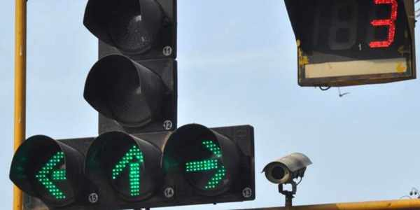

<p align="center">
 
</p>

<h1 align="center">Adaptive Traffic Signal Timer</h1>

<div align="center">

[](https://www.python.org/downloads/release/python-370/)
[](https://www.apache.org/licenses/LICENSE-2.0)

<h4>This Adaptive Traffic Signal Timer uses live images from the cameras at traffic junctions for traffic density calculation using YOLO object detection and sets the signal timers accordingly, thus reducing the traffic congestion on roads, providing faster transit to people, and reducing fuel consumption.</h4>

</div>


------------------------------------------
### Implementation Details

This project can be broken down into 3 modules:

1. `Vehicle Detection Module` - This module is responsible for detecting the number of vehicles in the image received as input from the camera. More specifically, it will provide as output the number of vehicles of each vehicle class such as car, bike, bus, truck, and rickshaw.

2. `Signal Switching Algorithm` - This algorithm updates the red, green, and yellow times of all signals. These timers are set bases on the count of vehicles of each class received from the vehicle detection module and several other factors such as the number of lanes, average speed of each class of vehicle, etc. 

3. `Simulation Module` - A simulation is developed from scratch using [Pygame](https://www.pygame.org/news) library to simulate traffic signals and vehicles moving across a traffic intersection.

------------------------------------------
### Demo

* `Vehicle Detection`

<p align="center">
 
</p>

<br> 

* `Signal Switching Algorithm and Simulation`

<p align="center">
    
</p>

------------------------------------------
### Prerequisites

1. [Python 3.7](https://www.python.org/downloads/release/python-370/)
2. [Microsoft Visual C++ build tools](http://go.microsoft.com/fwlink/?LinkId=691126&fixForIE=.exe.) (For Windows only)

------------------------------------------
### Installation

* Step I: Clone the Repository
```sh
      $ https://github.com/Bhunesh/smart-traffic-signal-.git
```

* Step II: Install the required packages
```sh
      # On the terminal, move into Adaptive-Traffic-Signal-Timer/Code/YOLO/darkflow directory
      $ cd Adaptive-Traffic-Signal-Timer/Code/YOLO/darkflow
      $ pip install -r requirements.txt
      $ python setup.py build_ext --inplace
```

* Step III: Run the code
```sh
      # To run vehicle detection
      $ python vehicle_detection.py
      
      # To run simulation
      $ python simulation.py
```


